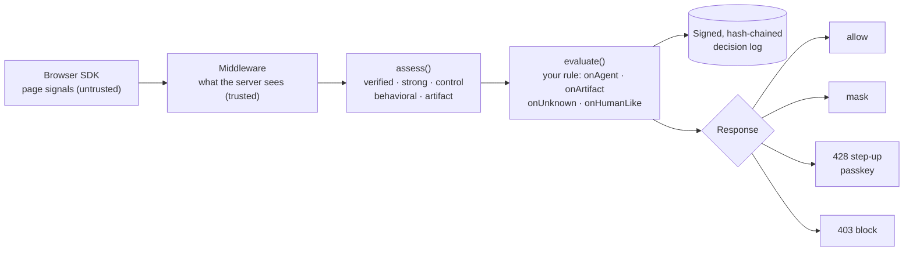

<p align="center">
  
</p>
<h1 align="center">OneHuman</h1>
<p align="center">
  <b>Bot protection, after login.</b><br>
  Your customers log in with Claude, ChatGPT and Codex. OneHuman decides what those agents may see and do.<br>
  It hides private data, asks the owner before anything risky, and signs every decision on your server.
</p>
<p align="center">
  <a href="https://www.npmjs.com/package/onehumanai"></a>
  <a href="https://github.com/OneHumanAI/onehumanai/actions/workflows/ci.yml"></a>
  <a href="LICENSE"></a>
</p>
<p align="center">
  <a href="https://onehuman.ai/crm"></a>
  &nbsp;
  <a href="https://cal.com/onehumanai"></a>
</p>
<p align="center">
  <a href="https://onehuman.ai/docs">Docs</a> ·
  <a href="https://onehuman.ai/compare">Compare</a> ·
  <a href="QUICKSTART.md">60-second overview</a> ·
  <a href="https://onehuman.ai/scorecard">Agent scorecard</a> ·
  <a href="https://onehuman.ai/measurements">How we measured</a> ·
  <a href="https://onehuman.ai/portal">Portal</a>
</p>

<!-- IMAGE: hero. The same CRM record for a person and for an AI agent: email and phone turn to dots, "Export contacts" waits for a passkey. GIF or PNG, about 1800 px wide. -->

---

## Who is this for?

B2B SaaS teams whose customers now use AI agents inside their accounts. If your product holds customer lists, invoices, settings or exports, this is for you.

OneHuman is **not** workforce AI security. It does not govern the agents your own employees run. It governs the agents your **customers** bring into your product.

## Why this?

Your customers now hand their signed-in session to an AI agent. Same cookies, same IP, same browser. To your server, the agent *is* the customer.

| Without OneHuman | With OneHuman |
| --- | --- |
| The agent reads customer lists, emails and invoices on screen, and sends them to a third-party model. | Private fields turn to dots before it reads them. |
| A misread page or a prompt injection exports your data, deletes records or changes billing. | Exports, deletes and billing changes wait for the owner's passkey. |
| Afterwards nobody can say whether the person or the agent acted. | Every decision is signed on your server. An auditor checks it offline. |

Bot management stops bots at the door and MFA checks who logged in. Neither sees the agent a real customer invited into their own session. OneHuman works inside the session, at the endpoint that returns the data.

## Tested against the agents your customers use

| Agent | Result | When it is caught |
| --- | --- | --- |
| Claude in Chrome | Caught, 37 of 37 steps | As it takes over the tab, before its first click |
| Claude desktop app | Caught, 10 of 10 clicks | At its first click |
| Codex, Chrome extension | Caught, 36 of 36 steps | As it takes over the tab, before its first click |
| Codex, built-in browser | Caught, 75 of 75 steps | At its first click |
| Plain Puppeteer or Playwright | Caught, 12 of 12 | At its first click |
| Stealth script written for one site | **Gets through**, 16 of 16 | Stopped by a passkey on the actions you mark as critical |
| People on Chrome, Safari and Windows | 395 of 397 clicks read as human | The other 2 are asked for a passkey, not blocked |

Every result, including the one that gets through: [Agent scorecard →](https://onehuman.ai/scorecard)

## What it does

<table>
<tr>
<td width="50%" valign="top">

### Spots the agent in 0.1 s
Agent tools leave traces in the page. OneHuman sees them before the agent's first click.

<!-- IMAGE: a page with an "AI agent" flag appearing as the agent attaches. -->

</td>
<td width="50%" valign="top">

### Private data turns to dots
Emails, phones and invoice totals are hidden from the agent. Everything else keeps working.

<!-- IMAGE: the email and phone fields masked, a normal action still going through. -->

</td>
</tr>
<tr>
<td width="50%" valign="top">

### Exports wait for a passkey
Exports, deletes and billing changes need the owner's Touch ID or Windows Hello. The agent can't approve itself.

<!-- IMAGE: the passkey dialog for contacts.export, then "approved". -->

</td>
<td width="50%" valign="top">

### Tells a hand from a program
A person's pointer curves, trembles and slows onto the button. A driver jumps and clicks in 1 to 4 ms. A real person is let in by their own click.

<!-- IMAGE: a human pointer trajectory next to an agent's instant click. -->

</td>
</tr>
<tr>
<td width="50%" valign="top">

### Every decision is signed
Allowed, hidden or approved: each one is signed with Ed25519 on your server. `npx onehumanai verify-proof` checks it offline, without trusting us.

<!-- IMAGE: terminal output of npx onehumanai verify-proof. -->

</td>
<td width="50%" valign="top">

### Watch first, block later
Observe mode records what would have happened and blocks nothing. Switch to enforce when you trust it.

<!-- IMAGE: the portal activity view with "would hide" / "would ask" decisions. -->

</td>
</tr>
</table>

## Quick start

```bash
npx onehumanai init
```

It reads your app, lists the routes an agent could misuse, and asks three short questions: what to protect, whether to only watch first, and your portal key (optional). It shows every change before it writes anything. For Express it wires the code for you.

This is what it writes:

```js
import { onehuman } from 'onehumanai';

const oh = await onehuman({ secret: process.env.ONEHUMAN_SECRET, policy: './onehuman.policy.json',
                            identify: (req) => req.session?.userId ?? null });
app.use(oh.middleware());
app.get('/api/customers', oh.protect('customers.read'), (req, res) => oh.send(req, res, customers, maskCustomers));
```
```html
<script src="/onehuman/sdk.js" data-fetch="auto" data-step-up="auto"></script>
```

Then check it:

```bash
npx onehumanai verify http://localhost:3000 /api/customers    # four checks, in seconds
```

Node 22.13 or newer. In a pnpm, yarn or bun project it uses your package manager.

**Using a coding agent?** Tell Claude Code or Codex *"install onehumanai"*. [AGENTS.md](AGENTS.md) is its protocol: analyse, propose, ask, implement, verify.

Prefer to wire it by hand? See the [docs](https://onehuman.ai/docs) or [QUICKSTART.md](QUICKSTART.md).

Want to see what agents already do in your product? Ask for the **[free 30 day agent report](https://onehuman.ai/report)** (watch only) or [book a demo](https://cal.com/onehumanai).

## Try it in one minute

1. Open the [live CRM demo](https://onehuman.ai/crm) yourself and click around. Everything works.
2. Open the same page with an AI agent (Claude in Chrome, ChatGPT agent, Comet) and ask it for the customer list or an export.
3. Watch the private fields get hidden and the export held for a passkey, while a person's own clicks still go through.

Found a way to fool it? [Open an issue](https://github.com/OneHumanAI/onehumanai/issues). Hard criticism is welcome.

## How it decides



"Unknown" is its own outcome and is never treated as human. If OneHuman is slow or fails, your app keeps working (it fails open, and says so in a header and in `/onehuman/health`).

## How it is different

| | Protects | Works where |
| --- | --- | --- |
| Bot management (Cloudflare, DataDome, Akamai, HUMAN) | Your site from bots | At the door, before login |
| Identity and MFA (Stytch, Transmit, Vouched) | Who logs in | At login |
| Workforce AI security (Noma) | The agents your employees run | Inside your company |
| **OneHuman** | What your customers' agents may see and do | Inside the customer's session, on your own server |

Noma governs the agents your employees use. OneHuman governs the agents your customers bring. Full scored table with 10 companies: [onehuman.ai/compare](https://onehuman.ai/compare) (marked from public documentation as of September 2026).

## Support

| | Status |
| --- | --- |
| Express 4/5, Connect, plain `node:http`, Next.js custom server | Supported |
| Python (Flask, Django, FastAPI), .NET, Java, via `npx onehumanai sidecar` | Supported, adapters in `packages/` |
| Fastify, Koa | Works through the raw Node request; no adapter yet |
| Desktop and mobile browsers | Supported |
| Go, Ruby, PHP backends | Not yet |
| Native iOS and Android apps | Not covered |
| Server-to-server API keys | Not covered: no browser, nothing to see |

A program written to fake a person's clicks for one site can pass the click check. That is why money-moving actions ask everyone for a passkey by default.

## Roadmap

- [x] Attach-time detection, screen seal, rules per endpoint
- [x] Passkey confirmation and session reclaim
- [x] Signed decision proofs and an offline verifier
- [x] Portal: activity, rules in plain words, 30-day report
- [x] One-command setup (`npx onehumanai init`)
- [ ] Customers mark a decision right or wrong in the portal; the false-stop rate becomes a live number
- [ ] Hosted agent-signature updates for self-hosted engines
- [ ] Fastify and Next.js adapters
- [ ] Touch layer for mobile browsers
- [x] Sidecar and adapters for Python, .NET and Java backends

## Repository

| Path | What |
| --- | --- |
| `server/` | Engine: signals, assessment, kinematics model, policy, audit, WebAuthn, Web Bot Auth, storage (sqlite / libSQL) |
| `sdk/onehuman.js` | Browser SDK: attach-time probes, pointer trajectories, seal on attach |
| `integrations/express/` | The middleware in `onehumanai` |
| `integrations/cli/` | `npx onehumanai init · verify · scan · inspect · report` |
| `packages/onehumanai/` | The published npm package |
| `packages/python`, `packages/dotnet`, `packages/java` | Adapters for Python, .NET and Java backends (they talk to `npx onehumanai sidecar`) |
| `examples/express-bank/` | A small Express app protected end to end |
| `tests/` | engine, middleware, CLI and sidecar tests (`npm test`); Python adapters in `packages/python/tests` |

This repository is the engine and everything you install. The website, the hosted portal and the live demos at [onehuman.ai](https://onehuman.ai) are not part of it.

```bash
npm install
npm run check          # typecheck + tests
npm run example        # a protected Express app on http://localhost:3000
npm run build:package  # packages/onehumanai/dist
```

## Contributing

Issues and pull requests are welcome, see [`CONTRIBUTING.md`](CONTRIBUTING.md). Security reports: [`SECURITY.md`](SECURITY.md). If OneHuman is useful to you, a ⭐ helps other developers find it.

## License

OneHuman is licensed in two parts. © 2026 Arif Babayev.

| Part | Licence | What it means for you |
| --- | --- | --- |
| Browser SDK, Express middleware, CLI, sidecar, proof verifier, Python/.NET/Java adapters | [Apache 2.0](LICENSE-APACHE) | Use, change and ship it anywhere, including closed-source products. Patent grant included. |
| Engine (`server/`, and `dist/engine.js` in `onehumanai`), build scripts | [Business Source License 1.1](LICENSE-BSL) | **Production use is granted**, including protecting your own apps and the services you give your customers. Not granted: offering OneHuman itself to others as a competing hosted or embedded product. Each version becomes Apache 2.0 four years after release. |

Versions before 0.4.0 were published under MIT and stay available under it. Contributions need the one-line [CLA](CLA.md).
